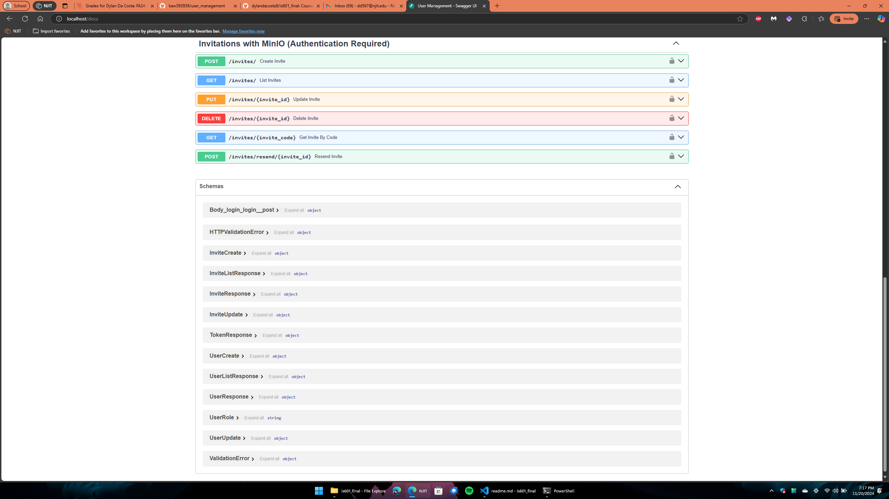
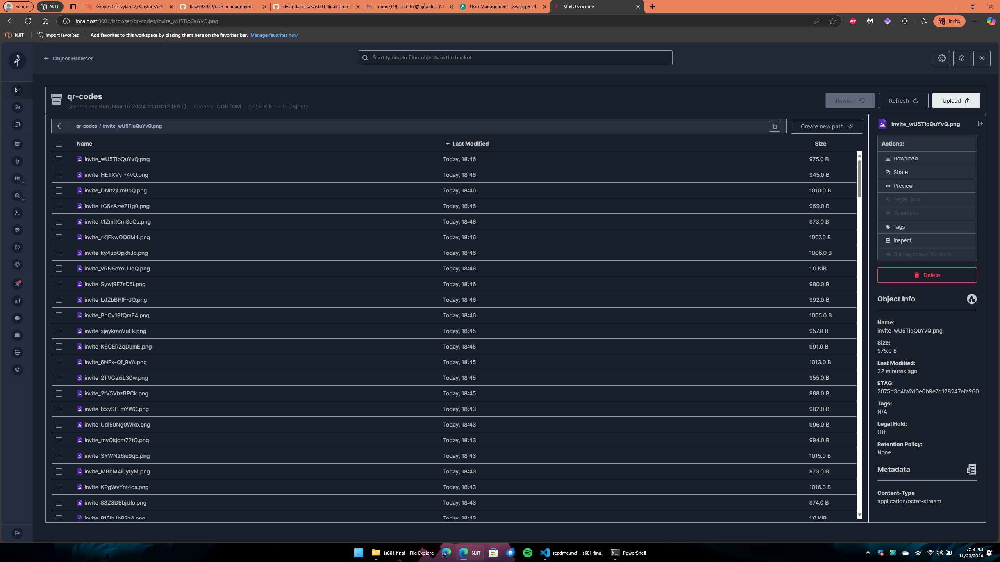
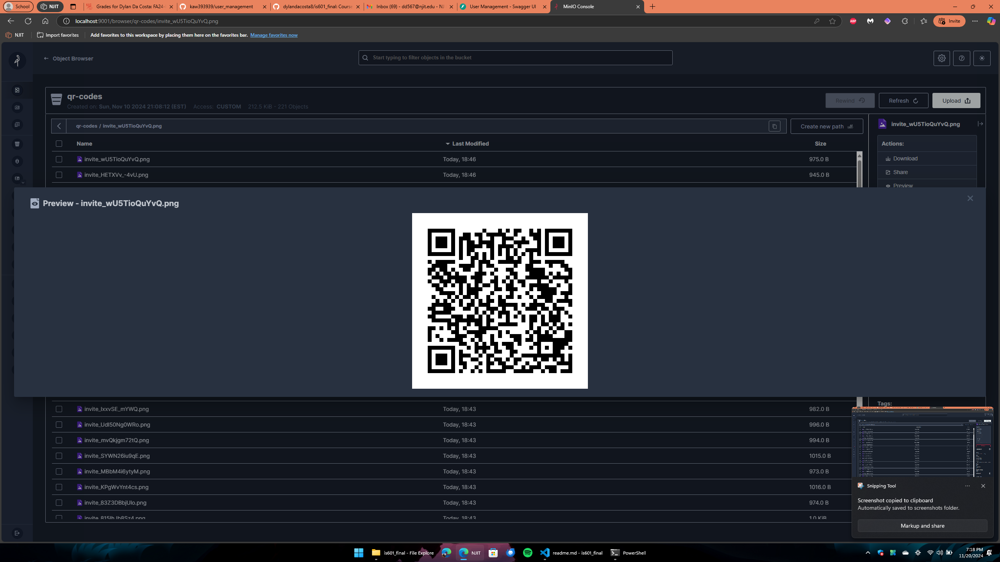
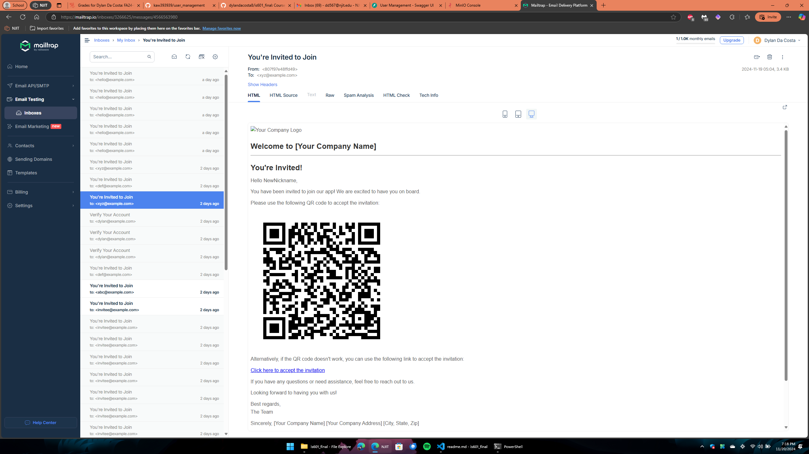

# <h1 align=center>QR Code Generation User Invites with MinIO</h1>
---
## Overview
The User Invitation System enables secure and efficient sharing of invitation links via QR codes. This system leverages MinIO for QR code storage and retrieval, ensuring scalability and reliability in managing generated QR codes. Additionally, it supports CRUD operations (BREAD) for invitations and follows HATEOAS principles for seamless API navigation.

---

## GitHub Issue Link - <a href="https://github.com/dylandacosta8/is601_final/issues/6">here</a>

---
<div align=center>

## Screenshots


Invitation Endpoints in FastAPI Swagger UI



---

MinIO Bucket



---

QRCode Preview in MinIO



---

Invitation Successfully Used Redirect Page


---

MailTrap Email Invite



</div>

---

## Features:

### 1. **Invitation Creation**
Users can send invites to others via email, including a unique invite code and a corresponding QR code for easy access.
#### API Details:
- **Route**: `POST /invites/`

#### Steps:
- **Creates an Invitation**: A new invitation is created with a unique ID and Invite Code.
- **Generate Invite Code**: A unique invite code is created for each invitation.
- **Generate QR Code**: The invite code is embedded into a QR code, allowing users to scan it to access the invitation link.
- **Store QR Code in MinIO**: The generated QR code is stored in a MinIO bucket for secure retrieval.

---

### 2. **MinIO Integration**
MinIO, an S3-compatible object storage solution, is used for storing and retrieving QR codes efficiently.

#### Key Points:
- **Bucket Structure**: QR codes are stored in a dedicated bucket, organized by user IDs or invite codes.
- **Access Control**: QR codes are private, ensuring that only authorized users can retrieve them.
- **Scalability**: MinIO supports large-scale storage, making it suitable for growing user bases.

---

### 3. **QR Code Generation**
The system generates QR codes using the unique invite codes. These QR codes encode the invitation URL for easy sharing.

#### Libraries Used:
- `qrcode`: For QR code generation.
- `Pillow`: For rendering the QR code images.

---

### 4. **Invitation Acceptance**
Users can accept an invitation by scanning the QR code or entering the invite code manually. 

#### API Details:
- **Route**: `GET /accept`

#### Steps:
- **Decode Nickname**: The nickname parameter is Base64-decoded.
- **Validate Invite Code**: The system verifies if the invite code exists and matches the provided nickname.
- **Mark Invitation as Used**: Upon successful validation, the invitation is marked as "used" in the database.
- **Redirect to Final Step**: A redirect URL is provided for further user onboarding.

---

### 5. **Resend Invitations**
Users can resend invitations in case the original invite is lost or expired. The system regenerates the QR code and re-sends the email.

#### API Details:
- **Route**: `POST /invitations/{invite_code}/resend`
- **Description**: Resends the invitation email with an updated QR code and invite link.

---

### 6. **Update Invitations**
Users can update invitation details, such as the recipient's email or expiration date, ensuring flexibility in managing invites.

#### API Details:
- **Route**: `PUT /invitations/{invite_code}`
- **Description**: Updates the invitation information.
- **Use Case**: Change invitee email or modify access permissions.

---

### 7. **Delete Invitations**
Users can delete invitations if they are no longer valid or required.

#### API Details:
- **Route**: `DELETE /invitations/{invite_code}`
- **Description**: Deletes the invitation and its corresponding QR code from MinIO.

---

### 8. **List Invitations by Code**
Retrieve detailed information about a specific invitation by its code.

#### API Details:
- **Route**: `GET /invitations/{invite_code}`
- **Description**: Fetches details for a single invitation.

---

### 9. List All Invitations for a User
Fetch all invitations created by a specific user.

#### API Details:
- **Route**: `GET /users/{user_id}/invitations`
- **Description**: Lists all invitations for a user with pagination.

---

### 10. BREAD Operations and HATEOAS
The system supports full BREAD operations (Browse, Read, Edit, Add, Delete) with HATEOAS links for easy API navigation.

- Example Response with HATEOAS:
```json
{
  "invite_code": "abc123",
  "email": "invitee@example.com",
  "status": "Pending",
  "_links": {
    "self": "/invitations/abc123",
    "resend": "/invitations/abc123/resend",
    "update": "/invitations/abc123",
    "delete": "/invitations/abc123"
  }
}
```

---

### Storage Structure in MinIO

- Bucket Name: qr-codes
- File Naming: invite_{invite_code}.png
```
qr-codes/
├── invite_abc123.png
├── invite_def456.png
```